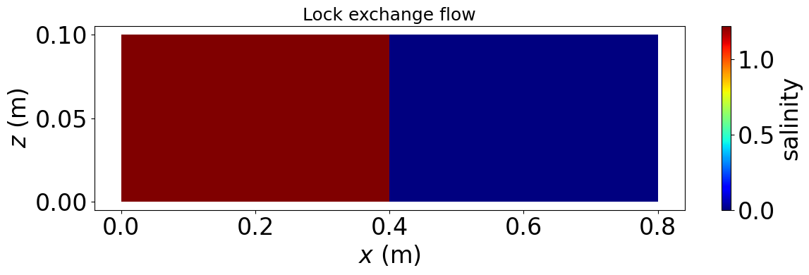

# 仮公開個人ページ

リンクの貼り方は以下 \
[ホームページ](../index.html)

数式は\$\$で囲むと書ける．
$$
\frac{1}{2}
$$

画像も埋め込める

gifも埋め込める?

Github pagesの制限として，リポジトリの容量が1GB未満である必要があるらしいので
むやみなgif貼り付けはしない方がいいかもしれない．(上記画像は29KB，gifは414KB)