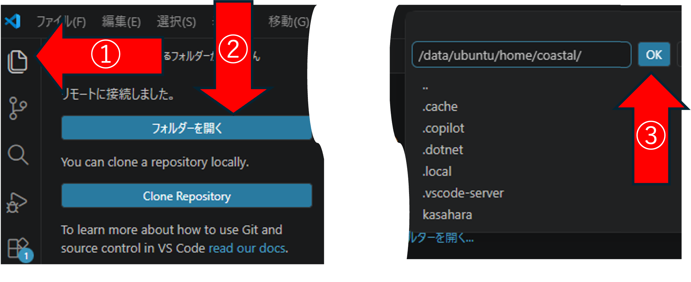
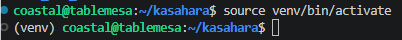

# サーバーPCの使い方

## 目次
- [サーバーpcの使い方](#サーバーpcの使い方)
  - [目次](#目次)
  - [VS CodeによるサーバーPCへの接続方法](#vs-codeによるサーバーpcへの接続方法)
  - [基本的な操作方法とルール](#基本的な操作方法とルール)
    - [基本的な操作方法](#基本的な操作方法)
    - [基本的なルール](#基本的なルール)
  - [セクション3](#セクション3)

## VS CodeによるサーバーPCへの接続方法
VS Codeの拡張機能として「Remote-SSH」をインストールする．

*Remote-SSHの導入*
リモートエクスプローラーが追加されるので，クリックしカーソル
をsshに合わせると「新しいリモート」が選択できるのでクリックする．

上中央に入力欄が出るので，ssh "name"@"ipaddress"を入れる．
ここで"name"は接続先のユーザー名であり，"ipaddress"は接続先のアドレスである．例として，ユーザー名"hoge"，アドレス"123.45.678.990"に接続する場合は\
ssh hoge@123.45.678.990 \
と入力する．

Select the platform of the remote hostと出るので，サーバーPCのOSを選択する（基本的にはLinux）

上中央にパスワード入力欄が出るので，所定のパスワードを入力すると接続される．

図のように
1. エクスプローラー
2. フォルダーを開く
3. /data/ubuntu/home/"name"/　でOKを押すことで，VS Code左側のエクスプローラーのカレントディレクトリを設定できる．

*接続先でのフォルダ選択*

## 基本的な操作方法とルール
### 基本的な操作方法
1. ファイル・フォルダ操作は基本的に左側にあるエクスプローラーの欄で行える右クリックでファイル作成・フォルダ作成・ダウンロードなどが可能
2. フォルダを右クリックで選択し「統合ターミナルで開く」を選択することで，そのフォルダをカレントディレクトリとしてターミナル(windowsでのコマンドプロンプト)を開くことができる
3. ターミナルではファイル作成，複製，gitコマンドなどが実行できる

### 基本的なルール
1. /data/ubuntu/home/"name"/ (ターミナル上では~/と表示される．左側のエクスプローラーでは.bashrcや.profileが存在するディレクトリ(階層))に各ユーザーごとのフォルダを作成し，自身のフォルダ内のみで作業を行うこと．他人のディレクトリは触らない．
2. 他人に誤って削除される恐れがあるため，共有アカウント内に置くファイルは消されても大丈夫なもののみにすること（自身のPCにバックアップを取っておくなど）
3. 上記の条件に沿っていればディレクトリ(フォルダ)・ファイルの作成は自由
4. Pythonは基本的に各ユーザーごとに仮想環境を構築して利用する（構築方法などは後述）．仮想環境は各ユーザーのディレクトリ内に作成すること

## Python仮想環境の作成と起動方法
1. 自身のディレクトリ内でターミナルを起動する
2. ターミナルで"python3 -m venv my_env"を実行する．→ディレクトリ内にmy_envが作成される．
この"my_env"部分は任意の名前で良い．他の名前にした場合はその名前で仮想環境が生成される．
3. source コマンドで作成した環境を起動する．例として，my_envで作成した場合は\
source my_env/bin/activate\
とする．起動するとターミナルに図のような環境名が表示される．\

*Python 仮想環境の起動*